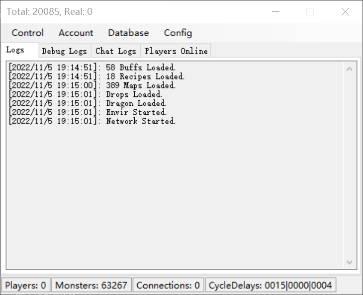

# Server

初次运行服务端遇到的错误`Cannot start server without atleast 1 Map and StartPoint`

需要塞入地图等相关的资源文件，这些文件包括
1. `Server/Server.MirDB`
2. `Server/Maps/`，地图信息
3. `Server/Envir/Recipe/`，矿石信息
4. `Server/Envir/Quests/`，任务信息
5. `Server/Envir/NPCs/`，NPC信息
6. `Server/Envir/SystemScripts/`, Mir2特有的脚本文件

---

再次运行时，会遇到`Cannot start server without mob: BoneFamiliar`。

这是因为`Server.MirDB`中记录的怪物名称是经过汉化的，需要在配置文件`Server/Configs/Setup.ini`中配置怪物名称。

---

`Cannot start server without mob: GiantKeratoid`

需要修改`Server/Configs/FishingSystem.ini`的`FishMonster`字段为`巨型多角虫`，使之与`Server.MirDB`中的汉化后的怪物名称想匹配。

---

`Cannot start server without item: BlackIronOre`

需要修改`Server/Configs/RefineSystem.ini`的`OreName`字段为`黑铁矿`，使之与`Server.MirDB`中的汉化后的怪物名称想匹配。

---

至此，服务端看起来可以正常跑起来。

---

默认的升级经验是每个等级都是100经验，可以更新升级经验配置文件`Server/Configs/ExpList.ini`，修改升级经验。

# Client

SlimDX找不到。使用NuGet为Client安装即可。

---

System.IO.FileNotFoundException
  HResult=0x80070002
  Message=未能加载文件或程序集“Microsoft.Web.WebView2.WinForms, Version=1.0.1020.30, Culture=neutral, PublicKeyToken=2a8ab48044d2601e”或它的某一个依赖项。系统找不到指定的文件。
  Source=Client
  StackTrace:
   在 Launcher.AMain.InitializeComponent() 在 C:\Workspace\Projects\mir2\Client\Forms\AMain.Designer.cs 中: 第 379 行
   在 Launcher.AMain..ctor() 在 C:\Workspace\Projects\mir2\Client\Forms\AMain.cs 中: 第 42 行
   在 Client.Program.Main(String[] args) 在 C:\Workspace\Projects\mir2\Client\Program.cs 中: 第 48 行

NuGet为Client卸载并重新安装即可。

---

非GM账户进入游戏时提示"Starting the game is currently disabled."

默认情况下，服务端是不允许普通用户进入游戏的（未开服），需要设置允许进入游戏。

---

禁用Launcher：考虑到暂时不支持热更资源，因此可以禁用Launcher，跳过热更。设置`Client/Mir2Test.ini`中`[Launcher]`节的`Enabled=False`

---

至此，已经可以进入游戏了

---

如果是设置了Server在远端机器，那么在启动Server时，监听的IP地址不能使用`127.0.0.1`, 需要使用`0.0.0.0`。
- 设置`Build/Server/Configs/Setup.ini`中`[NetWork]`节中的`IPAddress=0.0.0.0`
- 或者在Server面板中设置

此外，如果远端服务器是腾旭云，还需要在安全组中设置放行7000端口（Server默认的监听端口）

对于Client, 则需要设置正确的远端机器IP
- 设置`Build/Client/Mir2Config.ini`中`[NetWork]`
- 设置`Build/Client/Mir2Test.ini`中`[NetWork]`（如果是Debug模式）

